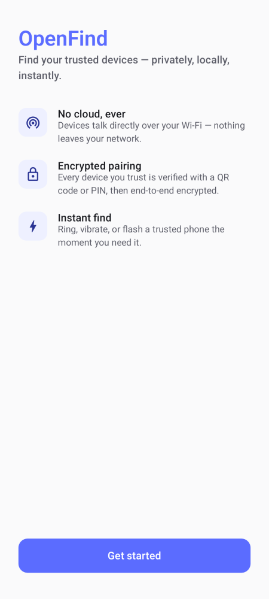
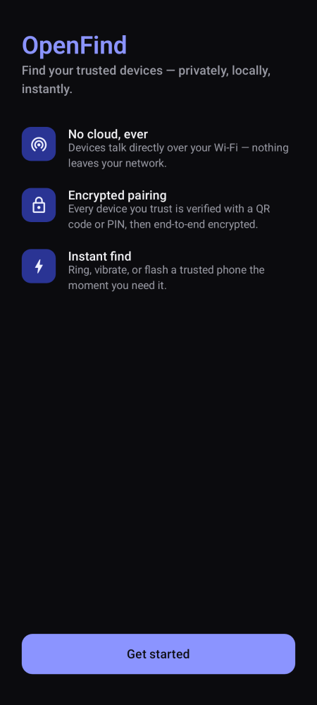

# OpenFind

**A privacy-first, local-network Android device finder.** OpenFind discovers your other trusted Android devices on the same Wi-Fi, pairs with them securely (QR code or PIN), and lets you locate, ring, vibrate, flash, and inspect them — with zero servers, zero accounts, and zero data ever leaving your network.

## Why OpenFind

Commercial "find my device" apps route everything through a company's cloud. OpenFind doesn't have one. Every feature — discovery, pairing, ringing a lost phone, checking its battery — happens directly between your devices over your local Wi-Fi, encrypted end-to-end with keys that never leave the Android Keystore.

## Screenshots

JVM-rendered (no emulator needed — see [Testing](#testing)) from the app's real Compose code:

| Welcome (light) | Welcome (dark) | Device list item |
|---|---|---|
|  |  |  |

## Features (current release)

- Secure onboarding with up-front, per-feature permission education, and a "What's new" screen on upgrade
- Local-network device discovery: mDNS/NSD, a UDP broadcast fallback for routers that block multicast, and a BLE presence signal for extra-fast awareness
- Encrypted pairing via QR code or 6-digit PIN (X25519 ECDH + HKDF + AES-256-GCM, Android Keystore-protected identity keys)
- Trusted device dashboard: battery, charging state, storage, RAM, uptime, last seen
- Ring, vibrate, and flashlight "Find my device" with a full-screen locate mode
- Device groups, activity history, and a searchable/filterable/sortable devices list
- Device nicknames and avatars (photo picker via Coil, or a colored initial)
- Background monitoring via a foreground service, with auto-reconnect (WorkManager), boot-start, network-change handling, and a battery-optimization exemption prompt
- Rich notifications: dedicated channels, grouped device-status alerts, low-battery and connection-change alerts, find alerts, and per-channel management
- Diagnostics screen with on-device log buffering and export, and a Developer options screen (verbose logging, raw discovery feed, database reset)
- Settings, Security, About, Privacy Policy, Open Source, Licenses, and Changelog screens
- Runtime recovery banner if a required permission gets revoked after the fact
- Material 3 UI with full dark/light theming

See [ROADMAP.md](ROADMAP.md) for what's next.

## Tech stack

Kotlin, Jetpack Compose + Material 3, type-safe Compose Navigation, MVVM + Clean Architecture, Hilt, Room, DataStore, Kotlin Coroutines/Flow, Kotlin Serialization, Android Keystore + Google Tink, Ktor Network (coroutine-native TCP sockets), Timber, WorkManager, Foreground Services, NSD + UDP + BLE discovery, CameraX + ZXing (QR), Coil, JUnit + MockK + Turbine + Truth (unit), Espresso + Compose UI Test + Hilt testing (instrumented), Paparazzi (JVM screenshot tests), ktlint + detekt (static analysis).

## Architecture

OpenFind is a single Gradle module organized by feature and layer (see [docs/ARCHITECTURE.md](docs/ARCHITECTURE.md) for the full breakdown, diagrams, and [docs/adr/](docs/adr/) for the reasoning behind key decisions):

```
app/src/main/java/com/openfinds/app/
├── core/
│   ├── crypto/         # Keystore-backed identity, X25519/HKDF/AEAD pairing crypto
│   ├── network/        # NSD/UDP/BLE discovery, Ktor-based TCP P2P protocol, device status/actions
│   ├── data/            # Room database, DataStore preferences
│   ├── domain/          # Domain models + repository interfaces
│   ├── diagnostics/     # In-memory log buffer + export
│   ├── background/      # Foreground service, WorkManager, notifications, boot/network receivers
│   ├── permissions/      # Runtime permission requirements + status checks
│   ├── navigation/       # Type-safe nav graph
│   ├── ui/              # Theme, shared composables, formatting helpers
│   └── di/              # Hilt modules
└── feature/
    ├── onboarding/       # Welcome, permissions
    ├── pairing/          # QR + PIN pairing
    ├── home/             # Dashboard
    ├── devices/          # Device list + details
    ├── groups/           # Device groups
    ├── history/          # Activity history
    ├── find/             # Full-screen find mode
    ├── notifications/    # Notification channel management
    ├── diagnostics/      # Log viewer + export UI
    ├── developer/        # Developer options
    └── settings/         # Settings, security, about, privacy, open source, licenses, changelog, what's new
```

## Building

Requirements: JDK 17+, Android SDK (compileSdk 35, minSdk 26).

```bash
./gradlew :app:assembleDebug     # -> app/build/outputs/apk/debug/app-debug.apk
./gradlew :app:assembleRelease   # -> app/build/outputs/apk/release/app-release.apk
./gradlew :app:bundleRelease     # -> app/build/outputs/bundle/release/app-release.aab
```

Convenience scripts live in [scripts/](scripts/) (bash and PowerShell): `build-debug`, `build-release`, `install-debug`, `install-release`. A local release build is signed only if `keystore.properties` exists at the repo root — copy [keystore.properties.example](keystore.properties.example) and fill it in.

### Automated releases

Pushing a `v*.*.*` tag triggers [.github/workflows/release.yml](.github/workflows/release.yml), which builds and attaches a release APK + AAB to a GitHub Release automatically. To have CI produce a **signed** build, add these repository secrets (Settings → Secrets and variables → Actions):

| Secret | Value |
|---|---|
| `RELEASE_KEYSTORE_BASE64` | `base64 -w0 release.keystore` output |
| `RELEASE_KEY_ALIAS` | your key alias |
| `RELEASE_KEY_PASSWORD` | your key password |
| `RELEASE_STORE_PASSWORD` | your keystore password |

Without these secrets, CI still builds and publishes an **unsigned** release artifact.

## Testing

```bash
./gradlew test                  # unit tests (ViewModels, repositories, crypto, formatting — MockK + Turbine + Truth)
./gradlew connectedAndroidTest  # instrumented tests: Compose UI + Espresso + Hilt (requires a device/emulator)
./gradlew recordPaparazzi       # regenerate the JVM-rendered screenshots under app/src/test/snapshots
./gradlew verifyPaparazzi       # verify current UI renders match the recorded snapshots (runs as part of `test`)
```

Paparazzi renders real Compose screens on the JVM without an emulator, which is how [the screenshots above](#screenshots) and the golden images in `app/src/test/snapshots` are produced.

## Code quality

```bash
./gradlew ktlintCheck detekt lint   # static analysis (also runs in CI)
./gradlew ktlintFormat              # auto-fix formatting
```

## Security & privacy

See [SECURITY.md](SECURITY.md) for the threat model, cryptographic design, and how to report a vulnerability. See [docs/PRIVACY.md](docs/PRIVACY.md) for a plain-English summary (also shown in-app under Settings → Security / Privacy policy).

## Contributing

Contributions are welcome — see [CONTRIBUTING.md](CONTRIBUTING.md). Please also read the [Code of Conduct](CODE_OF_CONDUCT.md).

## License

OpenFind is licensed under the [Apache License 2.0](LICENSE).
