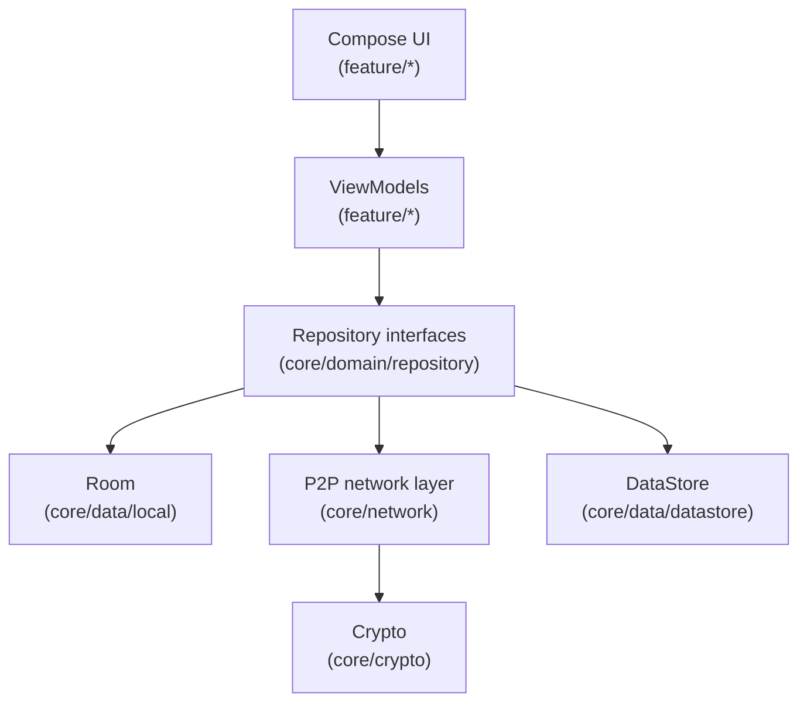
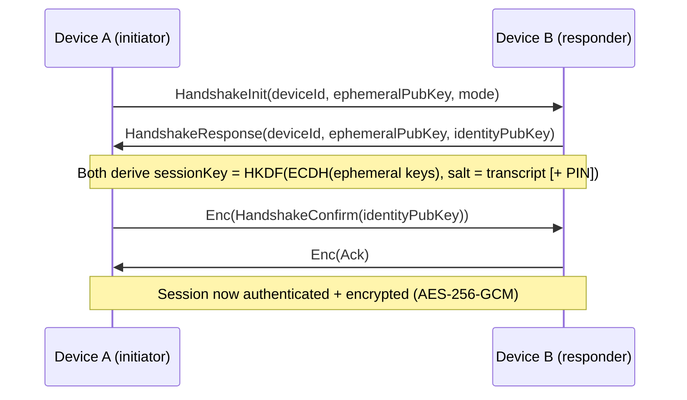

# Architecture

## Overview

OpenFind is a single-module Android app (`:app`) organized by feature and layer, following MVVM + Clean Architecture principles: UI depends on ViewModels, ViewModels depend on repository interfaces, and repository implementations depend on data sources (Room, DataStore, the network layer). Dependencies point inward — nothing in `core/domain` depends on Android framework or UI types.

## Why a single Gradle module

Real multi-module Gradle builds (`:core:data`, `:core:network`, `:feature:pairing`, etc.) add real value at team scale, but also add real build-graph complexity. For this initial release we organized strictly by *package* instead — `core/*` and `feature/*` — preserving the same dependency direction and separation of concerns, so splitting into Gradle modules later (tracked in [ROADMAP.md](../ROADMAP.md)) is a mechanical refactor rather than a redesign.

## Pairing handshake

See [SECURITY.md](../SECURITY.md) for the full cryptographic rationale.

## Background monitoring

`DeviceMonitorService` (a foreground service, type `dataSync`) owns the TCP listen socket, NSD advertisement, and UDP presence beacon for as long as the user has background monitoring enabled. `ReconnectWorker` (WorkManager, every 15 minutes) probes trusted devices that haven't been seen recently, so "last seen" stays accurate even through Doze. `BootCompletedReceiver` restarts the service after reboot if the user has background monitoring enabled; `NetworkChangeReceiver` restarts it on Wi-Fi changes so NSD re-advertises on the new network.

## Package layout

See the tree in [README.md](../README.md#architecture).
